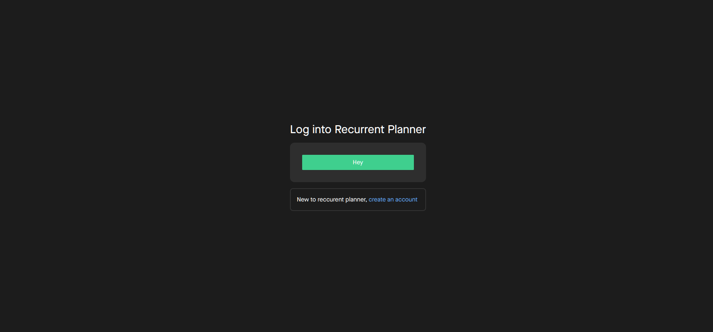
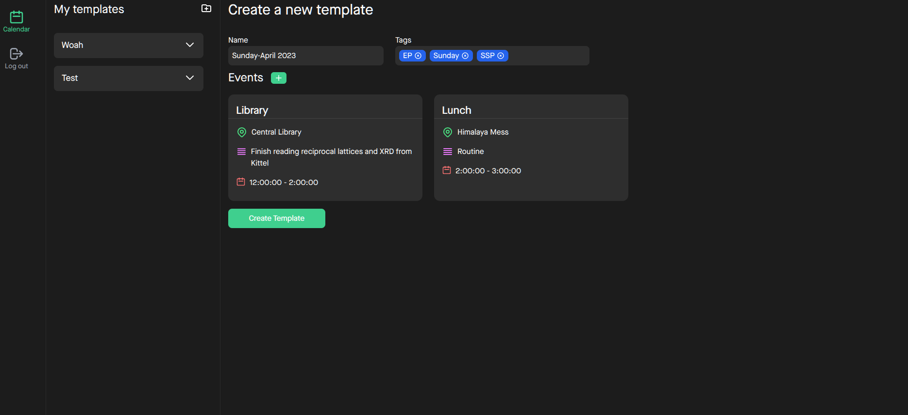
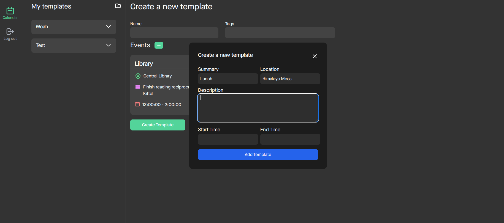
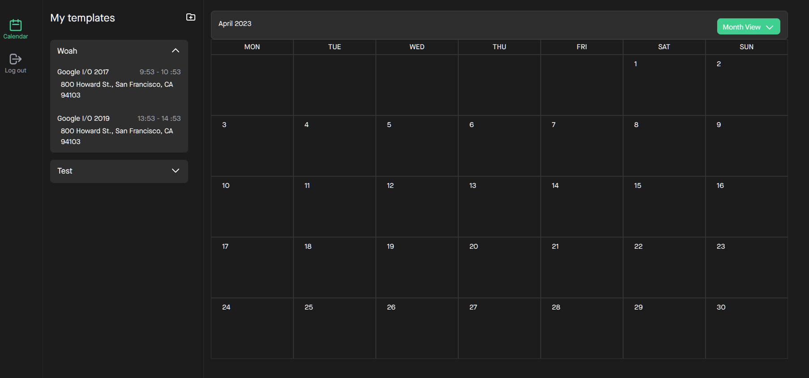

# Recurring Planner

For those with recurring plans(pun intended)

## The why?

Why create another calendar app when there are already so many available? How can it be better than established apps like Google Calendar or Cal? Recurring Planner was designed to address a significant issue I encountered while using Google Calendar - the absence of templates. With Recurring Planner, you can create a set of templates to accommodate different days in your life (e.g., University Monday, Quiz Week Weekend, Chill Sunday), all synchronized with your Google Calendar.

## What does it do?

With recurring planner, you can create templates and apply them to the days on which you want to follow them

## Screenshots


&nbsp;
&nbsp;
&nbsp;

&nbsp;
&nbsp;
&nbsp;

&nbsp;
&nbsp;
&nbsp;


## I like this, how can i use this?

### Prerequesites

- Node JS (>16.13.1)
- Golang compiler (>1.19.2)
- Postgres instance

### Steps

The only way to use Recurring Planner is to host it on your own. Steps to get RP up and running:

1. Clone the repository

   ```bash
   git clone https://github.com/RS2007/recurring-planner.git
   ```

2. Create two .env variables, one in the frontend and the other in the backend

   - For the frontend .env file add these fields:

     1. ```env
        #frontend
           VITE_GOOGLE_CLIENT_ID=<your-google-client-id>
           VITE_GOOGLE_SCOPE=https://www.googleapis.com/auth/calendar
           VITE_GOOGLE_REDIRECT_URI=http://localhost:5000/api/auth
        ```

     2. ```env
        #backend
           POSTGRES_USER=<postgres-user>
           POSTGRES_PORT=<postgres-port, usually 5432>
           POSTGRES_PASSWORD=<postgres-password>
           POSTGRES_DB_NAME=<postgres-db-name>
           JWT_SECRET=<your-jwt-secret>
           GOOGLE_CLIENT_ID=<your-google-client-id>
           GOOGLE_CLIENT_SECRET=<your-google-client-secrte>
           GOOGLE_REDIRECT_URI=http://localhost:5000/api/auth
        ```

   3. To generate google clientId and secret token go to google developers console, create an application, give permission to the /auth/calendar,/auth/userinfo.profile and /auth/userinfo.email
   4. For the redirect URI on the console, give http://localhost:5000/api/auth and the javascript origin as http://localhost:5000.
   5. ```bash
       cd frontend && npm run build
       cp -R dist ../backend
       cd ../backend
       go run .
      ```
   6. Go to your brower and type in http://localhost:5000

## I have issues trying to get it running

- Feel free to raise an issue in case you have difficulties getting it up and running.
